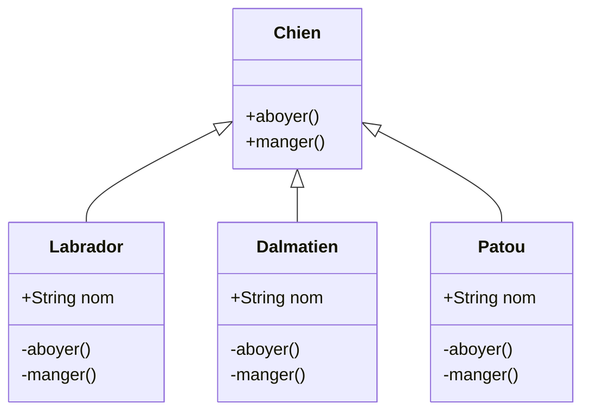

# Abstraction

### Qu'est-ce que le concept d'abstraction ?

L'abstraction est un processus qui permet de masquer les détails d'implémentations ou inutiles à l'utilisateur afin de ne montrer que les informations pertinentes. 

*Exemple :* Lors de l'envoi d'un mail, la partie visible concerne le destinataire, l'objet et le contenu. La partie invisible concerne toute l'implémentation technique lors de l'envoi (protocoles utilisés, adresses IPs, routes...).

### Pourquoi l'utiliser ?

L'objectif principal est de cacher les détails non-necéssaires à l'utilisateurs. L'abstraction c'est sélectionner des données dans un ensemble large, afin de ne  montrer que les détails pertinent d'un objet à l'utilisateur.

### Quand l'utiliser ?

Les méthodes abstraites sont utilisées lorsque que deux ou plusieurs sous-classes effectuent la même chose de manière différentes à travers différentes implémentations. Ils héritent (extends) aussi de la même classe abstraite et offre différentes implémentations des méthodes abstraites.

### Difference entre Abstraction et Encapsulation

| Abstraction                                                                                           | Encapsulation                                                                                                      |
| ----------------------------------------------------------------------------------------------------- | ------------------------------------------------------------------------------------------------------------------ |
| Abstraction in Object Oriented Programming solves the issues at the design level.                     | Encapsulation solves it implementation level.                                                                      |
| Abstraction in Programming is about hiding unwanted details while showing most essential information. | Encapsulation means binding the code and data into a single unit.                                                  |
| Data Abstraction in Java allows focussing on what the information object must contain                 | Encapsulation means hiding the internal details or mechanics of how an object does something for security reasons. |

### Difference entre Classe Abstraite et Interface

| Abstract Class                                                                                | Interface                                                    |
| --------------------------------------------------------------------------------------------- | ------------------------------------------------------------ |
| An abstract class can have both abstract and non-abstract methods.                            | The interface can have only abstract methods.                |
| It does not support multiple inheritances.                                                    | It supports multiple inheritances.                           |
| It can provide the implementation of the interface.                                           | It can not provide the implementation of the abstract class. |
| An abstract class can have protected and abstract public methods.                             | An interface can have only have public abstract methods.     |
| An abstract class can have final, static, or static final variable with any access specifier. | The interface can only have a public static final variable.  |

### Démonstration

