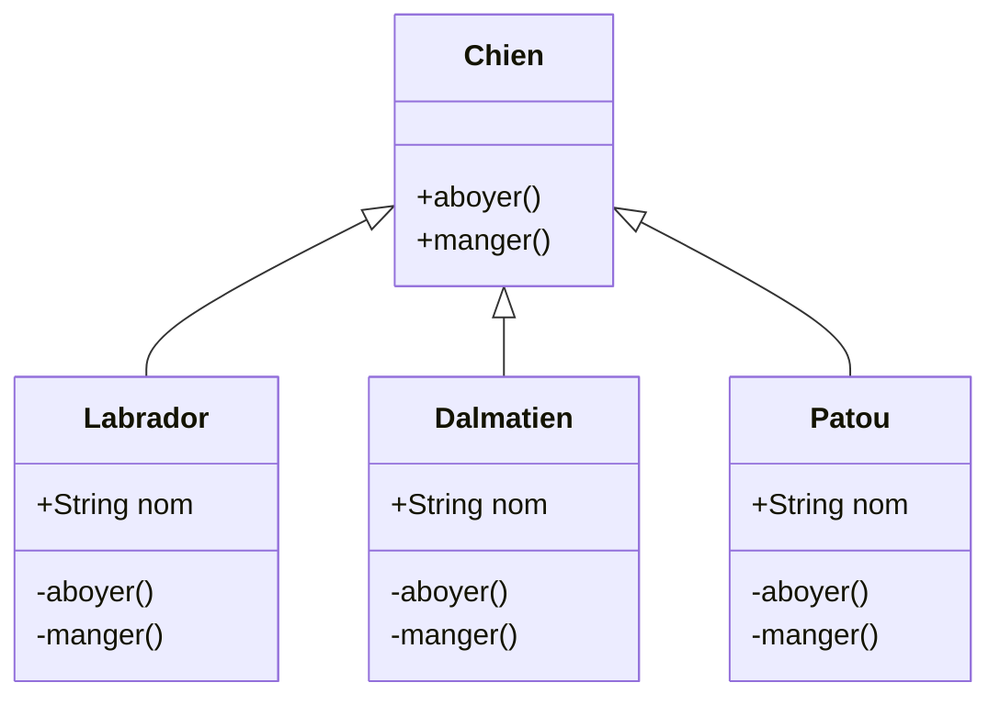

# Héritage

### Qu'est-ce que le concept d'héritage ?

L'héritage permet à une sous-classe d'hériter des attributs et méthodes d'une classe parent.

*Exemple* : Supposons une classe parent `Humain`  possèdant des méthodes telles que respirer(), parler() manger(), boire()... Si une classe enfant hérite de la classe `Humain` , alors cette sous-classe héritera des attributs et méthodes de la classe `Humain`.

### Pourquoi l'utiliser ?

L'idée derrière l'héritage en Java est que vous pouvez créer de nouvelles classes qui sont construites sur des classes existantes. Lorsque vous héritez d'une classe existante, vous pouvez réutiliser les méthodes et les champs de la classe parent.

### Quand l'utiliser ?

Nous pouvons utiliser l'héritage lorsque nous savons qu'il existe une relation "est un" entre un enfant et sa classe parent. Voici quelques exemples : Une personne est un être humain. Un chat est un animal.

# Overriding

### Qu'est-ce que le concept d'overriding ?

Si la sous-classe (classe enfant) a la même méthode que celle déclarée dans la classe parent, on parle de remplacement de méthode en Java. En d'autres termes, si une sous-classe fournit l'implémentation spécifique de la méthode qui a été déclarée par l'une de ses classes parentes, on parle de remplacement de méthode (Overriding).

### Pourquoi l'utiliser ?

L'avantage de la redéfinition est la possibilité de définir un comportement spécifique au type de sous-classe, ce qui signifie qu'une sous-classe peut implémenter une méthode de classe parente en fonction de ses besoins.

### Quand l'utiliser ?

Le but du Overriding est que si la classe dérivée veut donner sa propre implémentation, elle peut le faire en remplaçant la méthode de la classe parent. Lorsque nous appelons cette méthode surchargée, elle exécute la méthode de la classe enfant, pas la classe parent.

# Polymorphisme

### Qu'est-ce que le concept de polymorphisme ?

Le polymorphisme c'est la capacité d'un objet à prendre plusieurs formes, c'est-à-dire de réaliser la même action mais de manières différentes.

### Pourquoi l'utiliser ?

Le polymorphisme permet d'écrire une méthode capable de traiter correctement de nombreux types de fonctionnalités différentes portant le même nom.

### Quand l'utiliser ?

La raison pour laquelle vous utilisez le polymorphisme est lorsque vous construisez des frameworks génériques qui prennent tout un tas d'objets différents avec la même interface. Lorsque vous créez un nouveau type d'objet, vous n'avez pas besoin de modifier le cadre pour s'adapter au nouveau type d'objet, tant qu'il suit les "règles" de l'objet.

# Abstraction

### Qu'est-ce que le concept d'abstraction ?

L'abstraction est un processus qui permet de masquer les détails d'implémentations ou inutiles à l'utilisateur afin de ne montrer que les informations pertinentes. 

*Exemple :* Lors de l'envoi d'un mail, la partie visible concerne le destinataire, l'objet et le contenu. La partie invisible concerne toute l'implémentation technique lors de l'envoi (protocoles utilisés, adresses IPs, routes...).

### Pourquoi l'utiliser ?

L'objectif principal est de cacher les détails non-necéssaires à l'utilisateurs. L'abstraction c'est sélectionner des données dans un ensemble large, afin de ne  montrer que les détails pertinent d'un objet à l'utilisateur.

### Quand l'utiliser ?

Les méthodes abstraites sont utilisées lorsque que deux ou plusieurs sous-classes effectuent la même chose de manière différentes à travers différentes implémentations. Ils héritent (extends) aussi de la même classe abstraite et offre différentes implémentations des méthodes abstraites.

### Difference entre Abstraction et Encapsulation

| Abstraction                                                                                                                          | Encapsulation                                                                                                                                     |
| ------------------------------------------------------------------------------------------------------------------------------------ | ------------------------------------------------------------------------------------------------------------------------------------------------- |
| L'abstraction dans la programmation orientée objet résout les problèmes au niveau de la conception.                                  | L'encapsulation le résout au niveau de l'implémentation.                                                                                          |
| L'abstraction en programmation consiste à masquer les détails indésirables tout en affichant les informations les plus essentielles. | L'encapsulation signifie lier le code et les données en une seule unité.                                                                          |
| L'abstraction de données en Java permet de se concentrer sur ce que l'objet d'information doit contenir.                             | L'encapsulation signifie cacher les détails internes ou les mécanismes de la façon dont un objet fait quelque chose pour des raisons de sécurité. |

### Difference entre Classe Abstraite et Interface

| Classe Abstraite                                                                                                            | Interface                                                           |
| --------------------------------------------------------------------------------------------------------------------------- | ------------------------------------------------------------------- |
| Une classe abstraite peut avoir à la fois des méthodes abstraites et non abstraites.                                        | L'interface ne peut avoir que des méthodes abstraites.              |
| Il ne prend pas en charge les héritages multiples.                                                                          | Il prend en charge plusieurs héritages.                             |
| Il peut fournir l'implémentation de l'interface.                                                                            | Il ne peut pas fournir l'implémentation de la classe abstraite.     |
| Une classe abstraite peut avoir des méthodes publiques protégées et abstraites.                                             | Une interface ne peut avoir que des méthodes abstraites publiques.  |
| Une classe abstraite peut avoir une variable finale, statique ou statique finale avec n'importe quel spécificateur d'accès. | L'interface ne peut avoir qu'une variable finale statique publique. |

### Démonstration

# Encapsulatation

### Qu'est-ce que le concept d'encapsulation ?

L'encapsulation décrit l'idée de regrouper des données et des méthodes qui fonctionnent sur ces données dans une unité, comme une classe en Java. Ce concept est également souvent utilisé pour masquer la représentation interne ou l'état d'un objet de l'extérieur. C'est ce qu'on appelle la dissimulation d'informations.

### Pourquoi l'utiliser ?

L'encapsulation nous permet de modifier le code ou une partie du code sans avoir à changer d'autres fonctions ou code. L'encapsulation contrôle la façon dont nous accédons aux données. Nous pouvons modifier le code en fonction des exigences en utilisant l'encapsulation. L'encapsulation simplifie nos applications.

### Quand l'utiliser ?

L'encapsulation est utilisée pour masquer les valeurs ou l'état d'un objet de données structuré à l'intérieur d'une classe, empêchant ainsi l'accès direct des parties non autorisées.

# Interfaces

### Qu'est-ce que le concept d'interface ?

Une interface est un type abstrait utilisé pour spécifier un comportement que les classes doivent implémenter. Une classe qui implémente une interface doit implémenter toutes les méthodes non par défaut décrites dans l'interface, ou être une classe abstraite.

### Pourquoi l'utiliser ?

Les interfaces servent à créer des comportements génériques : si plusieurs classes doivent obéir à un comportement particulier, on créé une interface décrivant ce comportement, on est la fait implémenter par les classes qui en ont besoin.

### Quand l'utiliser ?

Envisagez d'utiliser des interfaces si : 

- Vous vous attendez à ce que des classes non liées implémententent votre interface. Par exemple, de nombreux objets non liés peuvent implémenter une interface sérialisable.

- Vous souhaitez spécifier le comportement d'un type de données particulier, mais vous ne vous souciez pas de savoir qui implémente son comportement.

- Vous souhaitez tirer parti de l'héritage multiple de type.

# Packages

### Qu'est-ce que les packages ?

Le package est un mécanisme permettant d'encapsuler un groupe de classes, de sous-packages et d'interfaces.

### Pourquoi l'utiliser ?

Les packages sont utilisés pour  prrévenir les conflits de noms. Par exemple, il peut y avoir deux classes avec le nom `Employee`dans deux packages, `college.staff.cse.Employee` et `college.staff.ee.Employee` .

### Quand l'utiliser ?

Les packages doivent être utilisés pour :

- Prévenir les conflits de noms. 

- Faciliter la recherche/localisation et l'utilisation des classes, des interfaces, des énumérations et des annotations.

- Fournir un accès contrôlé : protected et default ont un contrôle d'accès au niveau du package. Un membre protégé est accessible par les classes du même package et ses sous-classes. Un membre par défaut (sans aucun spécificateur d'accès) est accessible uniquement par les classes du même package.

- Les packages peuvent être considérés comme une encapsulation de données (ou un masquage de données).
